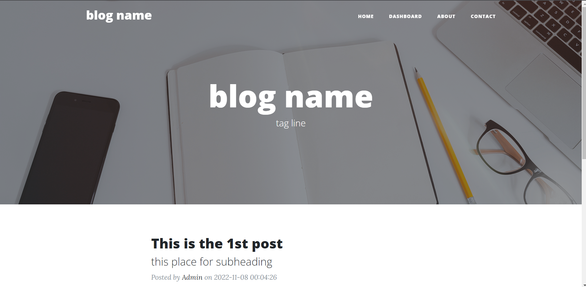
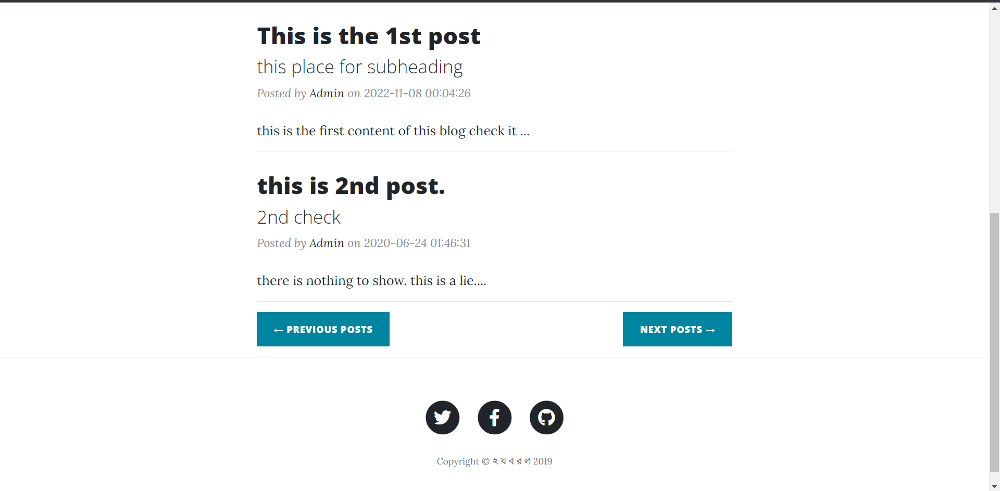
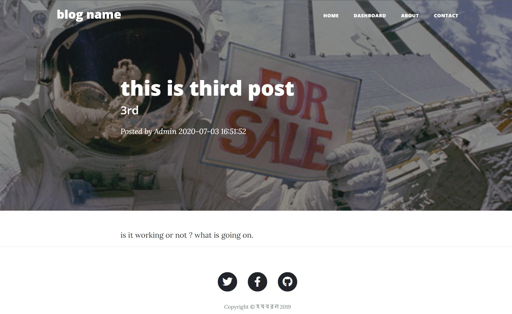
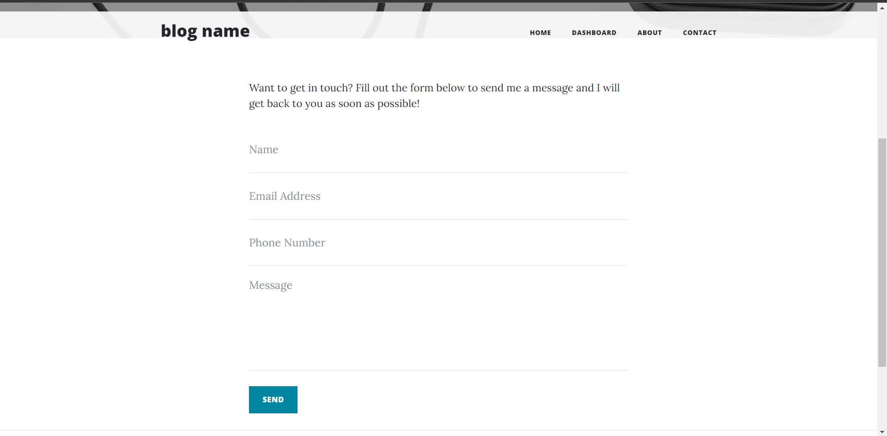
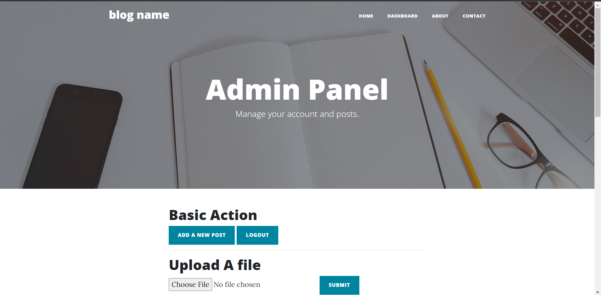
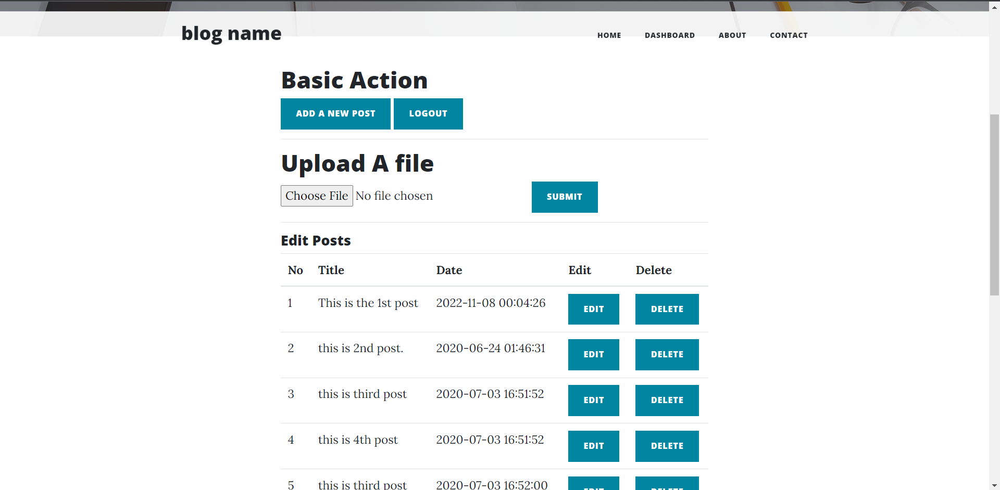
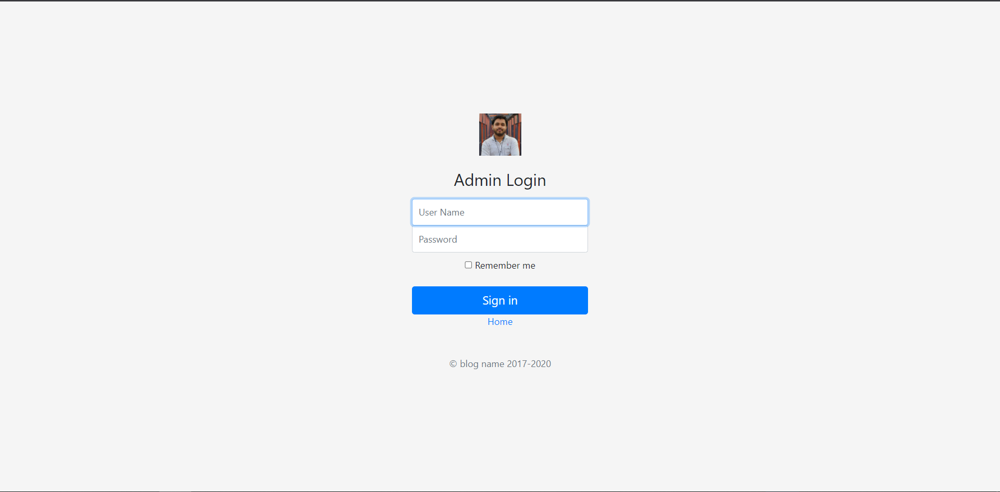

# Flask project: One user personal blog

<!-- &nbsp; -->

This project is a re-implementation of blog_with_harry in flask. I did this for my learning process.

# Features
* CRUD - create, read, update, delete operations
* Flask web app
* Admin login
* Add, delete, edit posts
* Upload images
* Mysql database system
* Contact through mail with owner

# Screenshots
> Home page

I keep only 2 posts on every page. It can be changed. User can go and check next and previous posts easily.

> Post page

> Contact page

From here any user can sent mail to the admin.

> Dashboard page

From this page admin can add, edit, and can delete posts.

> Admin login page

# Requirements and Tools:
I did this project on flask using Mysql database.

You check this on your side. But install flask and some other packages. Use pycharm it will easy your work. You can use this blog by changing config.json file.
Just check it once and don't forget to import sql file on Mysql server.

# <a href="https://github.com/ShuvoSahaRoy/Journey-with-Flask-microwebframe/tree/main/flask_blog" ><strong>Project link</strong> </a>

---

<strong>made by Shuvo Saha Roy with 💕 and 🤘</strong>

<video src='readme_images/main.wmv' width=180/>
